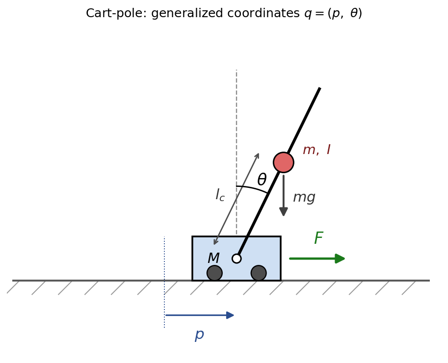

# Chapter 2 — Mathematical Models of Systems

{: .no_toc }

Control design begins with a **mathematical model** of the plant. This chapter
develops the theory behind that model: how physical laws become **differential
equations**, how **energy methods (the Lagrangian)** produce the equations of
motion of multi-body systems, why and when we may **linearize** a nonlinear
model, how the **Laplace transform** turns calculus into algebra, what a
**transfer function** really represents, and how **pole locations** govern
stability. Most worked numerical examples live in the lecture slides; here we
focus on *why* each tool works and *when* it is valid, with one fully worked
mechanical example — the **cart-pole** — carried through the modeling steps.

  
Contents

{: .text-delta }
1. TOC
{:toc}

---

## Learning Objectives

By the end of this chapter you should be able to:

- Explain what a mathematical model is, the assumptions behind it, and the
  trade-off between **fidelity and simplicity**.
- Derive equations of motion by **energy methods (the Euler–Lagrange equation)**
  and cast any mechanical system in the standard form
  $$M(q)\ddot q + C(q,\dot q)\dot q + g(q) = \tau$$.
- State the defining properties of a **linear, time-invariant (LTI)** system and
  explain why linearity is so powerful.
- Justify **linearization** as a Taylor-series approximation about an
  equilibrium point and describe its **region of validity**.
- Define the **Laplace transform**, its **region of convergence**, and the
  conditions guaranteeing its existence, and interpret its key properties.
- Define the **transfer function**, relate it to the **impulse response**, and
  use **poles and zeros** to reason about **stability** and natural behavior.
- Interpret a **block diagram** as an algebra of interconnected transfer
  functions and derive the closed-loop feedback relation.

---

## 2.1 What a Mathematical Model Is — and Is Not

A **mathematical model** is a set of equations that relate a system's **inputs**
to its **outputs** closely enough to be useful for a particular purpose. The
phrase *for a particular purpose* is essential: a model is not "the truth" about
a system but a **deliberate approximation** chosen to answer a specific question.

Why we build models at all:

- **Prediction** — anticipate behavior before hardware exists.
- **Analysis** — reason about stability, speed, and accuracy systematically.
- **Design** — synthesize controllers that meet specifications.
- **Insight** — expose *which* physical parameters actually drive behavior.

### The fidelity–simplicity trade-off

Every model sits on a spectrum between two failure modes. Too **simple**, and it
omits dynamics that matter (the controller works on paper but not in hardware).
Too **complex**, and it becomes analytically intractable and obscures the
dominant effects. Good modeling is the art of keeping the **smallest set of
dynamics that still captures the behavior of interest**.

### Standing assumptions in this course

To stay in the realm of classical control we will almost always assume the model
is:

- **Lumped-parameter** — described by a finite number of states (ordinary, not
  partial, differential equations). Mass, stiffness, and damping are treated as
  concentrated elements rather than spatially distributed fields.
- **Linear** — superposition holds (Section 2.4); when it does not, we
  *linearize* (Section 2.5).
- **Time-invariant** — the parameters do not change with time, so the system's
  response to an input does not depend on *when* the input is applied.
- **Causal** — the output depends only on present and past inputs.

These four assumptions are exactly what make the Laplace-domain, transfer-function
machinery of the rest of the course apply.

### From physical laws to equations

Modeling is systematic, not ad hoc. The recipe is always the same:

1. **Define** the system boundary, the input/output variables, and the constant
   parameters.
2. **Apply the governing physical laws** — Newton's laws (mechanical),
   Kirchhoff's laws (electrical), conservation of energy/momentum — to each
   element.
3. **Combine** the element equations into a governing **differential equation**
   (or a set of them).
4. **Linearize** about an operating point if any term is nonlinear.
5. **Transform** to the Laplace domain to obtain the **transfer function**, and
   organize the result as a **block diagram**.

---

## 2.2 Differential-Equation Models

### Element laws and the standard LTI form

Physical modeling rests on a small library of **element laws** relating effort
and flow variables. In translational mechanics, for example, the three passive
elements contribute forces:

$$
\text{inertia: } F = M\ddot y, \qquad
\text{damping: } F = b\dot y, \qquad
\text{stiffness: } F = k y.
$$

Summing them through Newton's second law produces a linear, constant-coefficient
ordinary differential equation. The **mass–spring–damper** is the canonical
second-order example,

$$
M\,\ddot y(t) + b\,\dot y(t) + k\,y(t) = r(t),
$$

and it is worth memorizing as a *structural template*: an **inertia** term
(highest derivative), a **dissipation** term (first derivative), a **restoring**
term (zeroth derivative), and a **forcing** input on the right. An enormous range
of electrical, thermal, and electromechanical systems reduces to exactly this
form, which is why second-order intuition carries so far in control.

In general, an $$n$$th-order LTI system is written

$$
a_n y^{(n)} + a_{n-1} y^{(n-1)} + \cdots + a_1 \dot y + a_0 y
= b_m r^{(m)} + \cdots + b_1 \dot r + b_0 r,
$$

with constant coefficients $$a_i, b_j$$. The **order** $$n$$ equals the number of
independent energy-storage elements (masses, springs, capacitors, inductors) and
fixes the number of initial conditions the system needs.

### Why some models are nonlinear

The LTI template breaks whenever an element law is not proportional. The
archetype is a rotating link under gravity (a one-DOF arm or pendulum),

$$
J\,\ddot\theta(t) + m g l\,\sin\theta(t) = \tau(t),
$$

where the **gravitational restoring torque is proportional to $$\sin\theta$$, not
to $$\theta$$**. That single transcendental term forbids a closed-form solution
and disqualifies the Laplace/transfer-function tools — which assume linearity.
Rather than abandon those tools, we **approximate** the model by a linear one
that is accurate near the operating point. That is the subject of Section 2.5.

---

## 2.3 Energy Methods: The Lagrangian

Newton's second law (Section 2.2) works element by element, but it forces us to
account for **every** force — including the internal **constraint forces** that
hold a mechanism together (the reaction at a pin joint, the normal force in a
slider). For a single mass these are a nuisance; for interconnected multi-body
systems — a robot arm, a cart with a pole hinged on top — they become the bulk
of the bookkeeping and most of them cancel in the end anyway. **Energy methods**
avoid them entirely: write down two scalar energies and turn a crank.

### Generalized coordinates and the Euler–Lagrange equation

Choose a set of **generalized coordinates** $$q = (q_1, \dots, q_n)$$ — a minimal
set of independent variables that completely specifies the configuration of the
system. Their number $$n$$ is the number of **degrees of freedom**. Form the
**Lagrangian** as the difference of kinetic and potential energy,

$$
L(q, \dot q) = T(q, \dot q) - V(q).
$$

The equations of motion are then the **Euler–Lagrange equations**, one per
coordinate:

$$
\frac{d}{dt}\!\left(\frac{\partial L}{\partial \dot q_i}\right)
- \frac{\partial L}{\partial q_i} = Q_i,
\qquad i = 1, \dots, n,
$$

where $$Q_i$$ is the **generalized force** — the non-conservative and external
inputs (actuator forces, applied torques, friction) associated with coordinate
$$q_i$$. Constraint forces that do no net work never appear. We trade a vector
force balance for a little calculus on two scalars, and for anything with more
than one moving body that is a large saving.

### The standard "manipulator" form

Carrying out the derivatives, the Euler–Lagrange equations of **any** rigid-body
mechanical system always collapse into the same structured second-order form:

$$
M(q)\,\ddot q + C(q, \dot q)\,\dot q + g(q) = \tau.
$$

Each term has a fixed physical meaning:

- $$M(q)$$ — the **inertia (mass) matrix**, symmetric and positive definite. It
  couples the accelerations; its entries can depend on configuration.
- $$C(q, \dot q)\,\dot q$$ — the **Coriolis and centrifugal** terms, always
  **quadratic in the velocities** (products $$\dot q_i \dot q_j$$).
- $$g(q) = \partial V/\partial q$$ — the **gravitational / conservative
  restoring** term.
- $$\tau$$ — the vector of **generalized forces** delivered by the inputs.

Solving for the accelerations,

$$
\ddot q = M(q)^{-1}\big(\tau - C(q,\dot q)\,\dot q - g(q)\big),
$$

is exactly the computation a physics engine performs at every timestep. A
simulator such as **PyBullet** (used in [`simulation/`](../simulation/)) is
handed only a description of the bodies and joints — masses, inertias, and how
the links connect — from which it *assembles* $$M$$, $$C$$, and $$g$$ internally
and integrates this equation forward. You never hand it the equations of motion;
it builds them from the same principles derived here.

### Worked example: the cart-pole

  

A cart of mass $$M$$ slides horizontally under an applied force $$F$$; a pole is
hinged to it and swings freely. The pole has mass $$m$$, moment of inertia $$I$$
about its own center of mass (COM), and its COM lies a distance $$l_c$$ from the
hinge. Take generalized coordinates

$$
q = (p, \theta),
$$

the **cart position** $$p$$ and the **pole angle** $$\theta$$ measured from the
upward vertical. Only the cart is driven, so the generalized forces are
$$Q_p = F$$ and $$Q_\theta = 0$$.

**Positions.** The cart sits at $$(p, 0)$$; the pole COM is at

$$
x_c = p + l_c \sin\theta, \qquad y_c = l_c \cos\theta.
$$

**Kinetic energy.** Differentiating, $$\dot x_c = \dot p + l_c\cos\theta\,\dot\theta$$
and $$\dot y_c = -l_c\sin\theta\,\dot\theta$$, so

$$
T = \tfrac12 M\dot p^2
  + \tfrac12 m\big(\dot x_c^2 + \dot y_c^2\big)
  + \tfrac12 I\dot\theta^2
  = \tfrac12 (M+m)\dot p^2
  + m l_c\cos\theta\,\dot p\,\dot\theta
  + \tfrac12\big(I + m l_c^2\big)\dot\theta^2 .
$$

**Potential energy.** Measuring from the hinge height, $$V = m g l_c\cos\theta$$.

**Euler–Lagrange.** Applying the equation to $$p$$ (with $$Q_p = F$$) and to
$$\theta$$ (with $$Q_\theta = 0$$) gives the two coupled equations

$$
(M+m)\,\ddot p + m l_c\cos\theta\,\ddot\theta - m l_c\sin\theta\,\dot\theta^2 = F,
$$

$$
m l_c\cos\theta\,\ddot p + \big(I + m l_c^2\big)\ddot\theta - m g l_c\sin\theta = 0.
$$

**Matrix form.** Collecting the accelerations puts the model in exactly the
standard structure:

$$
\begin{bmatrix} M+m & m l_c\cos\theta \\[2pt]
                m l_c\cos\theta & I + m l_c^2 \end{bmatrix}
\begin{bmatrix} \ddot p \\[2pt] \ddot\theta \end{bmatrix}
=
\begin{bmatrix} F + m l_c\sin\theta\,\dot\theta^2 \\[2pt]
                m g l_c\sin\theta \end{bmatrix}.
$$

Reading off $$M(q)\ddot q + C(q,\dot q)\dot q + g(q) = \tau$$ term by term,

$$
M(q) = \begin{bmatrix} M+m & m l_c\cos\theta \\ m l_c\cos\theta & I + m l_c^2 \end{bmatrix},
\quad
C(q,\dot q)\dot q = \begin{bmatrix} -m l_c\sin\theta\,\dot\theta^2 \\ 0 \end{bmatrix},
\quad
g(q) = \begin{bmatrix} 0 \\ -m g l_c\sin\theta \end{bmatrix},
\quad
\tau = \begin{bmatrix} F \\ 0 \end{bmatrix}.
$$

Two features are worth naming. First, $$\tau$$ has an entry only in the cart row:
the pole carries **no motor**, so this is an **underactuated** system — one
actuator, two degrees of freedom — which is exactly what makes balancing it a
control problem rather than a bookkeeping one. Second, the model is fully general
in $$l_c$$ and $$I$$; for a **uniform rod** of length $$L$$ one substitutes
$$l_c = L/2$$ and $$I = mL^2/12$$ (so that $$I + m l_c^2 = mL^2/3$$), while a
**point mass** at the tip is the special case $$l_c = L,\ I = 0$$.

**Toward control.** Near the upright equilibrium $$\theta \approx 0$$ we may take
$$\sin\theta \approx \theta$$, $$\cos\theta \approx 1$$, and drop the
$$\dot\theta^2$$ term — the linearization of the next section — which turns this
nonlinear model into an LTI state-space pair $$(A, B)$$. That linear model is
what the LQR controller in [`simulation/cartpole/`](../simulation/cartpole/) is
designed on, and we return to it in **state-space** form in Chapter 8.

---

## 2.4 Linearity, Time-Invariance, and Why They Matter

### The definition

An operator (system) $$L$$ mapping inputs to outputs is **linear** if it satisfies
two properties:

- **Additivity (superposition):** if $$x_1 \mapsto y_1$$ and $$x_2 \mapsto y_2$$,
  then $$x_1 + x_2 \mapsto y_1 + y_2$$.
- **Homogeneity (scaling):** if $$x \mapsto y$$, then $$\alpha x \mapsto \alpha y$$
  for every scalar $$\alpha$$.

The two collapse into a single statement,

$$
L(\alpha x_1 + \beta x_2) = \alpha\,L(x_1) + \beta\,L(x_2),
$$

which says the system "distributes over" weighted sums of inputs.

### Linear vs. affine — a subtle but important distinction

A static map is linear only if its graph is a **straight line through the
origin**. The relation $$y = mx + c$$ with $$c \neq 0$$ is **affine**, not linear:
it fails homogeneity because $$L(0) = c \neq 0$$. This matters in practice because
a constant bias (gravity preload, sensor offset, a nonzero operating point) makes
a system affine — and we recover linearity by measuring all variables as
**deviations from the operating point**, which is precisely what linearization
does.

### Why linearity is the prize

Superposition is not a convenience; it is the foundation of nearly every analysis
method in this course:

- We may decompose a complicated input into simple pieces (impulses, steps,
  sinusoids), find the response to each, and **add** the results.
- The response to a sinusoid is a sinusoid of the **same frequency** — the basis
  of frequency-response (Bode/Nyquist) methods in Chapter 7.
- The Laplace transform and transfer functions exist **only** for linear systems.

### Time-invariance

A system is **time-invariant** if delaying the input merely delays the output by
the same amount: $$x(t) \mapsto y(t)$$ implies $$x(t - T) \mapsto y(t - T)$$.
Combined with linearity, this is what allows a system to be represented by a
single, fixed transfer function (Section 2.7) rather than a relationship that
changes from moment to moment.

### Recognizing nonlinearity at a glance

A model is nonlinear if it contains any of: products of variables ($$x\dot x$$),
powers ($$x^2$$), transcendental functions ($$\sin x$$, $$e^x$$), or
discontinuities (saturation, friction, backlash, hysteresis). Most real systems
contain several — yet most behave **approximately linearly within a limited
operating range**, which is what makes the next section so useful.

---

## 2.5 Linearization

### The idea: a tangent approximation about an equilibrium

Linearization replaces a nonlinear function by its **tangent** at an operating
point and studies only **small deviations** from that point. The operating point
is usually an **equilibrium** (or *trim*) condition — a state at which the system
can rest with constant input, so the derivatives vanish. We then ask how the
system responds to small perturbations *about* that equilibrium, which is exactly
the regime in which a controller holding a setpoint operates.

### Single-variable theory

Expand a nonlinear function $$f(x)$$ in a Taylor series about $$x_0$$:

$$
f(x) = f(x_0) + \left.\frac{df}{dx}\right|_{x_0}(x - x_0)
     + \frac{1}{2!}\left.\frac{d^2 f}{dx^2}\right|_{x_0}(x - x_0)^2 + \cdots
$$

For **small** deviations $$x - x_0$$, the quadratic and higher terms shrink far
faster than the linear term, so we keep only the first two:

$$
f(x) \approx f(x_0) + \left.\frac{df}{dx}\right|_{x_0}(x - x_0).
$$

The slope $$\left.\tfrac{df}{dx}\right|_{x_0}$$ is a **constant gain**; the model
has become linear in the deviation variable $$\Delta x = x - x_0$$. The classic
illustration is the small-angle approximation $$\sin\theta \approx \theta$$, which
turns the pendulum equation into a linear oscillator — *valid only while
$$\theta$$ stays small*.

### Multivariable theory and the Jacobian

For a state model $$\dot{\mathbf{x}} = f(\mathbf{x}, \mathbf{u})$$ linearized about
an equilibrium $$(\mathbf{x}_0, \mathbf{u}_0)$$, the same first-order expansion in
several variables gives

$$
\Delta\dot{\mathbf{x}} \approx
\underbrace{\left.\frac{\partial f}{\partial \mathbf{x}}\right|_0}_{A}
\Delta\mathbf{x}
+
\underbrace{\left.\frac{\partial f}{\partial \mathbf{u}}\right|_0}_{B}
\Delta\mathbf{u}.
$$

The partial-derivative matrices $$A$$ and $$B$$ are **Jacobians** evaluated at the
operating point. This is precisely the state-space model we will design with in
Chapter 8 — linearization is the bridge from a nonlinear plant to linear
state-feedback design.

### What we gain, and what we give up

Linearization is a **trade**: we exchange global accuracy for a model we can
actually analyze with linear tools. The approximation is trustworthy only in a
neighborhood of the operating point and degrades as the system swings away from
it. A system linearized about one equilibrium may behave very differently about
another (a pendulum is stable hanging down, unstable balanced up) — the *same*
nonlinear plant yields *different* linear models at different operating points.

---

## 2.6 The Laplace Transform

### Why transform at all

Solving linear differential equations directly in the time domain means
repeatedly integrating. The Laplace transform converts the **calculus** of LTI
systems into **algebra**: differentiation becomes multiplication by $$s$$, and
integration becomes division by $$s$$,

$$
\frac{d}{dt} \;\longleftrightarrow\; s, \qquad
\int_0^t (\cdot)\,d\tau \;\longleftrightarrow\; \frac{1}{s}.
$$

A differential equation becomes a polynomial equation that we solve by ordinary
algebra, then transform back. The whole transfer-function method depends on this.

### Definition and region of convergence

For a signal $$f(t)$$ defined for $$t \ge 0$$, the (one-sided) Laplace transform is

$$
F(s) = \mathcal{L}\{f(t)\} = \int_0^{\infty} f(t)\,e^{-st}\,dt,
\qquad s = \sigma + j\omega \in \mathbb{C}.
$$

It maps a function of **time** $$t$$ to a function of the **complex frequency**
$$s$$. The integral converges only for $$s$$ in a right half-plane
$$\mathrm{Re}(s) > \alpha$$ called the **region of convergence**; the factor
$$e^{-\sigma t}$$ is what tames the growth of $$f(t)$$ and makes the improper
integral finite. We use the **one-sided** transform (lower limit $$0$$) because
control problems have a definite "switch-on" instant and because it cleanly
encodes **initial conditions**.

### When does the transform exist?

Two **sufficient** conditions guarantee existence:

1. **Piecewise continuity** — on every finite interval of $$[0,\infty)$$, $$f$$ is
   continuous except at finitely many points, where it may *jump* but the
   one-sided limits stay finite (no vertical asymptotes).
2. **Exponential order** — the signal grows no faster than some exponential:
   there are constants $$M > 0$$, $$\alpha$$, $$T \ge 0$$ with
   $$|f(t)| \le M e^{\alpha t}$$ for all $$t \ge T$$. This caps the growth so that,
   for $$\mathrm{Re}(s) > \alpha$$, the decaying $$e^{-st}$$ wins and the integral
   converges.

These are **sufficient, not necessary** — some functions violate them yet still
have transforms. Conceptually: polynomials, exponentials, and sinusoids are all
of exponential order (and transformable), whereas violently growing functions
such as $$e^{t^2}$$ are **not** of exponential order and have no Laplace transform.

### The properties that do the work

The power of the method is in a handful of properties:

| Property | Time domain | $$s$$-domain | Meaning |
|---|---|---|---|
| Linearity | $$a f + b g$$ | $$aF + bG$$ | mirrors system linearity |
| Differentiation | $$\dot f$$ | $$sF(s) - f(0)$$ | derivative → multiply by $$s$$; **carries the initial condition** |
| Second derivative | $$\ddot f$$ | $$s^2F(s) - s f(0) - \dot f(0)$$ | initial position *and* velocity appear |
| Integration | $$\int_0^t f\,d\tau$$ | $$F(s)/s$$ | accumulation → divide by $$s$$ |
| Time delay | $$f(t-T)u(t-T)$$ | $$e^{-Ts}F(s)$$ | a pure delay is the factor $$e^{-Ts}$$ |
| Final value | $$\lim_{t\to\infty} f(t)$$ | $$\lim_{s\to 0} sF(s)$$ | steady state without inverting* |
| Initial value | $$\lim_{t\to 0^+} f(t)$$ | $$\lim_{s\to\infty} sF(s)$$ | the jump at $$t=0^+$$ |

*The **final-value theorem** is valid only when $$sF(s)$$ has all its poles in the
open left half-plane; otherwise the time limit does not exist and the formula is
meaningless. This caveat is itself a stability statement — a preview of
Section 2.8.

Notice how the differentiation property threads the **initial conditions**
$$f(0), \dot f(0)$$ into the algebra. Transfer functions adopt the convention of
**zero initial conditions**, under which $$\dot f \to sF(s)$$ and
$$\ddot f \to s^2 F(s)$$ exactly — turning a differential equation into a clean
multiplication.

---

## 2.7 Transfer Functions, Poles, and Zeros

### Definition and meaning

The **transfer function** is the Laplace transform of the output divided by that
of the input, assuming zero initial conditions:

$$
G(s) = \frac{Y(s)}{R(s)} = \frac{p(s)}{q(s)}
     = \frac{b_m s^m + \cdots + b_1 s + b_0}{a_n s^n + \cdots + a_1 s + a_0}.
$$

It is an **intrinsic property of the system**, independent of the particular
input: the same $$G(s)$$ predicts the response to a step, a ramp, or a sinusoid.
For the canonical second-order system, $$G(s) = 1/(Ms^2 + bs + k)$$.

### The transfer function *is* the impulse response

There is a deep reason transfer functions are so central. If the input is a unit
impulse $$r(t) = \delta(t)$$, then $$R(s) = 1$$ and $$Y(s) = G(s)$$ — so $$G(s)$$ is
the **Laplace transform of the impulse response** $$g(t)$$. Equivalently, in the
time domain the output is the **convolution** $$y(t) = g(t) * r(t)$$, and the
Laplace transform turns that convolution into the simple product
$$Y(s) = G(s)R(s)$$. The transfer function packages everything the LTI system can
ever do into a single function of $$s$$.

### Properness

A transfer function is **proper** when $$m \le n$$ (numerator degree no greater
than denominator) and **strictly proper** when $$m < n$$. Physical systems are
proper — a strictly proper system cannot respond instantaneously to an input,
reflecting that real plants have inertia. An improper $$G(s)$$ would imply pure
differentiation of the input, which amplifies noise without bound and is not
physically realizable on its own.

### Poles and zeros

- **Zeros** are the roots of the numerator $$p(s) = 0$$. At these complex
  frequencies the transfer function is zero, so a zero **blocks** transmission and
  shapes the *transient* response (it can cause overshoot or undershoot).
- **Poles** are the roots of the denominator $$q(s) = 0$$. They are the system's
  **natural frequencies** — the values of $$s$$ for which the system can sustain a
  response with no input. They dominate the character of the response and decide
  stability.

The denominator equation $$q(s) = 0$$ is the **characteristic equation**; its
roots (the poles) are the **modes** of the system. A pole at $$s = p$$ contributes
a term proportional to $$e^{pt}$$ to the natural response, so the geometry of the
poles in the complex plane *is* the time behavior.

---

## 2.8 Stability and the s-Plane

### BIBO stability

> A system is **bounded-input bounded-output (BIBO) stable** if **every** bounded
> input produces a bounded output.

For an LTI system this abstract definition reduces to a purely **geometric** test
on the poles, because each pole $$p = \sigma + j\omega$$ injects a mode $$e^{pt}$$
whose envelope is $$e^{\sigma t}$$:

$$
\text{Stable} \iff \text{every pole satisfies } \mathrm{Re}(s) < 0
\quad(\text{open left half of the } s\text{-plane}).
$$

### Reading the s-plane

The real part of a pole sets growth or decay; the imaginary part sets oscillation
frequency:

| Pole location | Mode envelope $$e^{\sigma t}$$ | Behavior |
|---|---|---|
| Left half-plane, $$\sigma < 0$$ | decays to zero | **stable** |
| Right half-plane, $$\sigma > 0$$ | grows without bound | **unstable** |
| On the imaginary axis, $$\sigma = 0$$ | constant or sustained oscillation | **marginally stable** |

A **single** pole in the right half-plane makes the whole system unstable,
regardless of how many well-damped poles accompany it. The poles nearest the
imaginary axis decay slowest and therefore **dominate** the long-term response —
the idea of *dominant poles* that underlies the design approximations of later
chapters. This pole-location view is what lets Chapters 5–7 judge and reshape
stability *without ever solving the differential equation*.

### Recovering the time response

To return from $$Y(s)$$ to $$y(t)$$ we use **partial-fraction expansion**: write
$$Y(s)$$ as a sum of simple first- and second-order terms whose inverse transforms
are tabulated, so each pole contributes its own mode to $$y(t)$$. The mechanics
are practiced in the slides; the conceptual point is that **each pole becomes one
term of the time response**, which is why pole locations tell us the behavior
before any inversion is done.

---

## 2.9 Electromechanical Coupling (DC Motor)

Many course plants — including the cart-pole and DC-motor simulations in
[`simulation/`](../simulation/) — are **electromechanical**: an electrical
subsystem drives a mechanical one through a coupling law. The DC motor is the
canonical case, and it illustrates how two element models combine into one
transfer function without us solving a specific numeric example.

- **Electrical side** (Kirchhoff's voltage law) couples applied voltage to
  armature current, opposed by a **back-EMF** proportional to speed,
  $$e_b = K_b\dot\theta$$.
- **Coupling law:** motor torque is proportional to current, $$T = K_t i$$ (from
  the Lorentz force on the windings).
- **Mechanical side** (Newton's law for rotation) relates that torque to inertia
  $$J$$ and friction $$b$$: $$J\ddot\theta + b\dot\theta = T$$.

Transforming each subsystem and eliminating the internal current variable yields
the voltage-to-speed transfer function

$$
\frac{\Omega(s)}{V(s)}
= \frac{K_t}{(Ls + R)(Js + b) + K_t K_b},
$$

where $$\Omega = s\Theta$$. The structural lesson is general: **model each energy
domain with its own law, link them through the coupling term, transform, and
eliminate the shared internal variables.** When the electrical time constant is
much faster than the mechanical one (small inductance $$L$$), the model collapses
to first order — a single left-half-plane pole, hence inherently stable — which is
why a simple DC motor is so easy to control.

---

## 2.10 Block-Diagram Models

### Diagrams as an algebra

A block diagram is a **graphical algebra** of transfer functions: each block
multiplies its input by $$G(s)$$, arrows carry signals, and summing junctions add
or subtract them. The value of the diagram is that it makes **signal flow and
feedback paths** explicit, where a wall of equations would hide them. Three
interconnection rules let us reduce any diagram of LTI blocks:

| Interconnection | Equivalent transfer function |
|---|---|
| **Series (cascade)** $$G_1$$ then $$G_2$$ | $$G_1 G_2$$ |
| **Parallel**, outputs summed | $$G_1 + G_2$$ |
| **Feedback**, forward $$G$$, feedback $$H$$ | $$\dfrac{G}{1 \pm GH}$$ |

### Deriving the feedback formula

The feedback rule is the most important relation in the course, and it follows
from one line of algebra. For **negative** feedback, the error is
$$E = R - HY$$ and the output is $$Y = GE$$. Substituting,

$$
Y = G(R - HY) \;\;\Rightarrow\;\; Y(1 + GH) = GR
\;\;\Rightarrow\;\;
\frac{Y(s)}{R(s)} = \frac{G(s)}{1 + G(s)H(s)}.
$$

The denominator $$1 + G(s)H(s)$$, set to zero, is the **closed-loop
characteristic equation** — its roots are the closed-loop poles. Feedback
**relocates the poles**, and that single fact is the lever behind every design
method to come: root locus (Chapter 6) traces *where* the poles move as a gain
varies, and the frequency-response methods (Chapter 7) judge stability from
$$G(s)H(s)$$ directly.

---

## Summary — the through-line

| Stage | Object | Key idea |
|---|---|---|
| Physical laws | differential equation | energy-storage elements set the order |
| Energy methods | Lagrangian $$L = T - V$$ | $$M(q)\ddot q + C\dot q + g = \tau$$, no constraint forces |
| Nonlinear → linear | Taylor / Jacobian | tangent model valid near an equilibrium |
| Time → frequency | Laplace transform | calculus becomes algebra in $$s$$ |
| Input–output | transfer function $$G(s)$$ | the transformed impulse response |
| Behavior | poles & zeros | poles are natural modes $$e^{pt}$$ |
| Stability | s-plane | all poles in $$\mathrm{Re}(s) < 0$$ |
| Interconnection | block diagram | feedback $$=\dfrac{G}{1+GH}$$ relocates poles |

## Course Materials
- 📊 Slides: [chapter2_mathematical_models](../slides/) — worked examples and derivations
- 📝 Examples: [Examples](../examples/)
- 💻 Simulation: [DC-motor & cart-pole code](../simulation/)

> **Looking ahead.** With a plant reduced to a transfer function and its poles,
> Chapter 4 reads the *time response* directly from pole locations, Chapter 5
> tests *stability* algebraically, and Chapter 8 returns to these same physical
> systems in **state-space** form.
