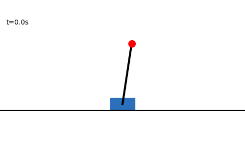
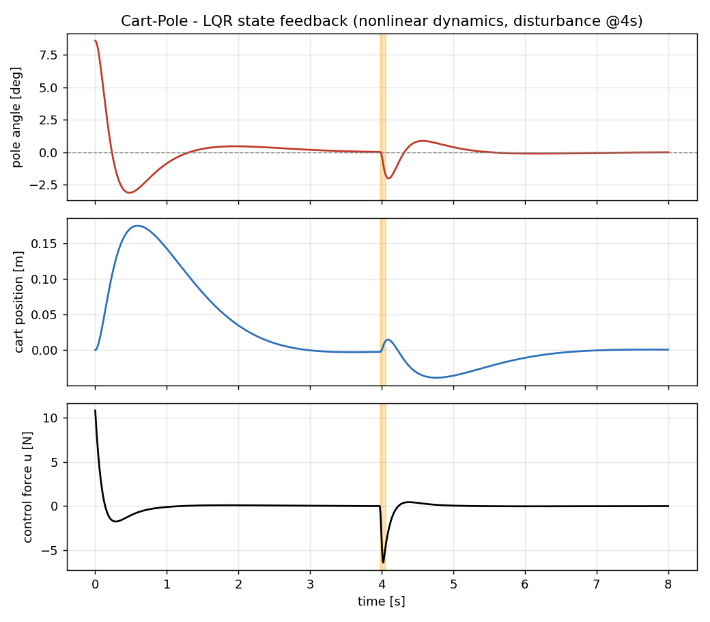

# Cart-Pole Balancing (LQR State Feedback)

The classic **cart-pole** (inverted pendulum on a cart) stabilized about its
upright equilibrium with an **LQR** state-feedback controller. This ties
together state-space modeling (Ch 8) and controller design (Ch 9).

  

State vector: $x = [\,p,\ \dot p,\ \theta,\ \dot\theta\,]^\top$ (cart position
and velocity, pole angle and rate). The system is linearized about the upright
position, then a gain $K$ is found from $u = -Kx$ minimizing
$J = \int_0^\infty (x^\top Q x + u^\top R u)\,dt$.

## Files

| File | Run | Needs |
|------|-----|-------|
| `cartpole_matlab.m` | `>> cartpole_matlab` in MATLAB | Control System Toolbox |
| `cartpole_python_scipy.py` | `python cartpole_python_scipy.py` | `numpy`, `scipy`, `matplotlib` |
| `cartpole_pybullet.py` | `python cartpole_pybullet.py` | `pybullet` (3D physics view) |

The MATLAB and SciPy versions integrate the nonlinear ODE directly (no physics
engine). The PyBullet version runs the same controller inside a 3D simulator.

## Expected result

The controller drives the pole angle to zero and re-centers the cart:

  

